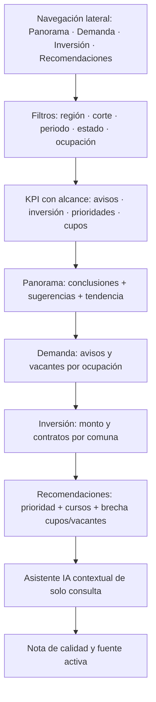
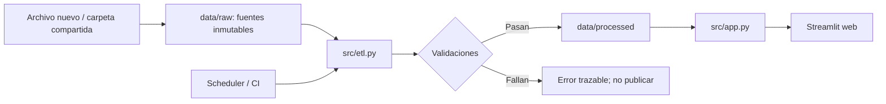

# Diseño de estructura del tablero

## Boceto funcional

## Criterio de organización

La autoridad navega por cuatro módulos persistentes y recibe una síntesis comparable mediante KPI y tendencia. Luego puede profundizar desde la señal de mercado hacia dos decisiones: dónde se concentra la inversión y si la oferta formativa cubre las prioridades. Los filtros permanecen en una barra lateral estable para no competir con los gráficos durante una proyección. Cada vista termina con hallazgos reproducibles y ofrece un chat compacto para consultar únicamente sus agregados.

### Jerarquía de decisión

La estructura sigue el orden en que una autoridad regional necesita comprender una situación: panorama y cambios relevantes, demanda ocupacional, inversión territorial y respuesta formativa. Cada módulo responde una pregunta de gestión y los KPI iniciales entregan magnitud y alcance antes del detalle. Demanda identifica presión laboral sin confundirla con la prioridad regional; Inversión usa monto y contratos por comuna y estado; y Recomendaciones vincula ranking, cursos y cupos por CIUO. La relación uno-a-muchos se muestra como cobertura, sin afirmar que los cupos satisfagan automáticamente las vacantes.

### Criterio UX/UI

La navegación lateral permanece disponible en todas las vistas para que región, periodo, fuente y filtros mantengan un lugar predecible. El botón de mostrar u ocultar la barra permite recuperar espacio de lectura sin perder la posibilidad de cambiar el contexto. Los filtros se agrupan antes del contenido y los de selección extensa se mantienen colapsados: así se reduce ruido visual y se evita que controles secundarios desplacen las visualizaciones de decisión.

La lectura visual es descendente: título y periodo activo, KPI comparables, nota de fuente, gráfico o tabla y hallazgos. Las barras se ordenan para facilitar comparación; la tendencia mensual conserva el tiempo en el eje horizontal; y las tablas se reservan para ver detalle después del resumen. Los colores no codifican una conclusión adicional: acompañan la jerarquía visual y mantienen contraste con el fondo. El diseño evita gráficos decorativos y privilegia etiquetas, unidades y títulos que se puedan leer en una pantalla proyectada.

### Confianza y continuidad de uso

La nota de fuente activa, el periodo aplicado y la sección de calidad hacen visible el alcance de cada resultado. Esto evita comparar cifras construidas con filtros distintos y permite que una autoridad distinga una señal de una decisión definitiva. Los hallazgos se calculan desde las tablas filtradas, por lo que son verificables. El asistente IA es opcional y contextual: ayuda a resumir los agregados visibles, pero no reemplaza los indicadores, no modifica datos y no incorpora evidencia fuera de la vista.

| Sección | Pregunta | Fuente y medida |
|---|---|---|
| Panorama | ¿Qué cambió y qué conviene revisar primero? | Variación de avisos; concentración de inversión; menor cobertura |
| Demanda | ¿Qué ocupaciones concentran avisos y vacantes? | Avisos, agrupados por CIUO y periodo |
| Inversión | ¿En qué comunas se concentra la inversión? | Suma de monto vigente y número de contratos |
| Recomendaciones | ¿Qué cursos responden a las prioridades y dónde hay menor cobertura? | Recomendaciones 1:N cursos por CIUO; cupos por cada 100 vacantes y nivel |

## Flujo de datos

La capa de presentación no modifica fuentes. La región es una dimensión y el archivo de avisos es un parámetro, por lo que la misma aplicación puede escalar sin duplicar tableros.