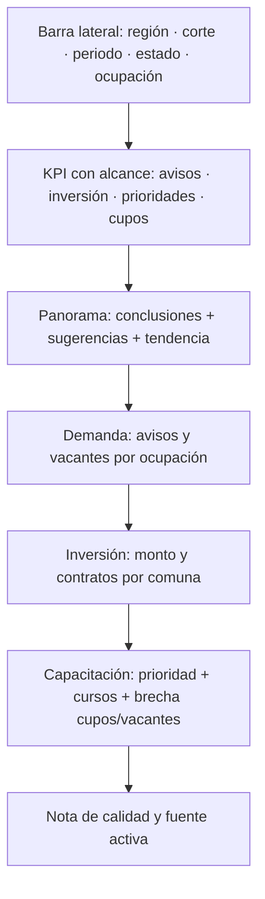
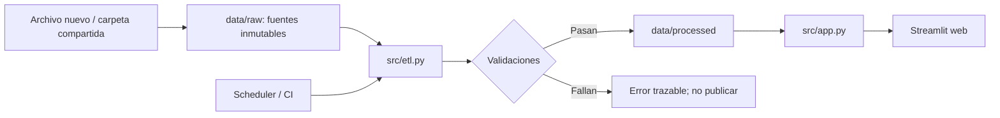

# Diseño de estructura del tablero

## Boceto funcional

## Criterio de organización

La autoridad primero recibe una síntesis comparable mediante KPI y tendencia. Luego puede profundizar desde la señal de mercado hacia dos decisiones: dónde se concentra la inversión y si la oferta formativa cubre las prioridades. Los filtros permanecen en una barra lateral estable para no competir con los gráficos durante una proyección.

| Sección | Pregunta | Fuente y medida |
|---|---|---|
| Panorama | ¿Qué cambió y qué conviene revisar primero? | Variación de avisos; concentración de inversión; menor cobertura |
| Demanda | ¿Qué ocupaciones concentran avisos y vacantes? | Avisos, agrupados por CIUO y periodo |
| Inversión | ¿En qué comunas se concentra la inversión? | Suma de monto vigente y número de contratos |
| Capacitación | ¿Qué cursos responden a las prioridades y dónde hay menor cobertura? | Recomendaciones 1:N cursos por CIUO; cupos por cada 100 vacantes y nivel |

## Flujo de datos

La capa de presentación no modifica fuentes. La región es una dimensión y el archivo de avisos es un parámetro, por lo que la misma aplicación puede escalar sin duplicar tableros.